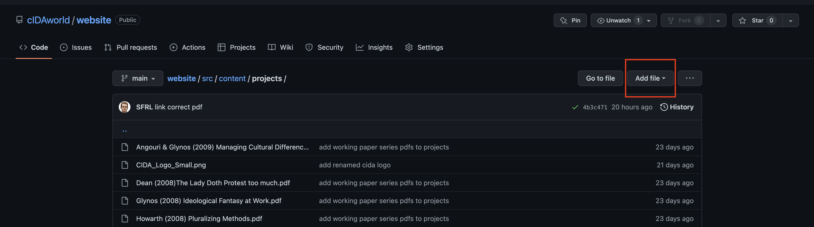
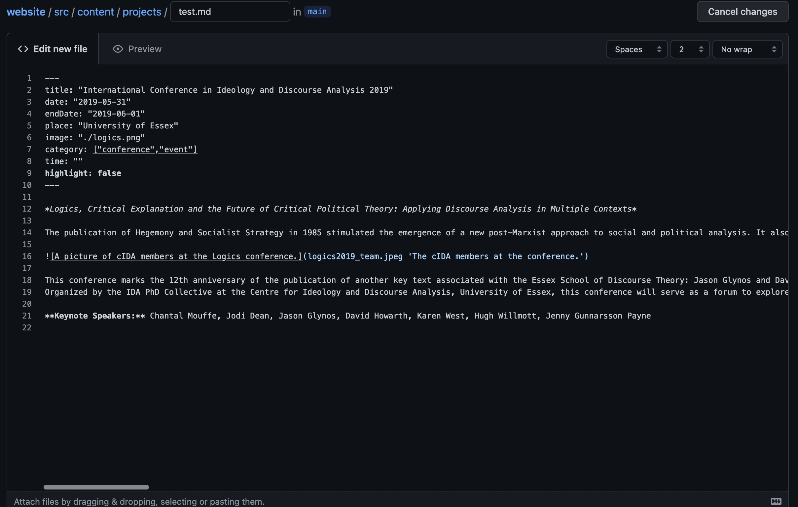
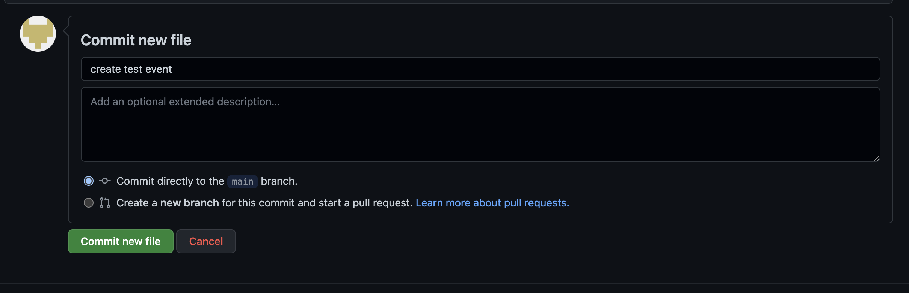
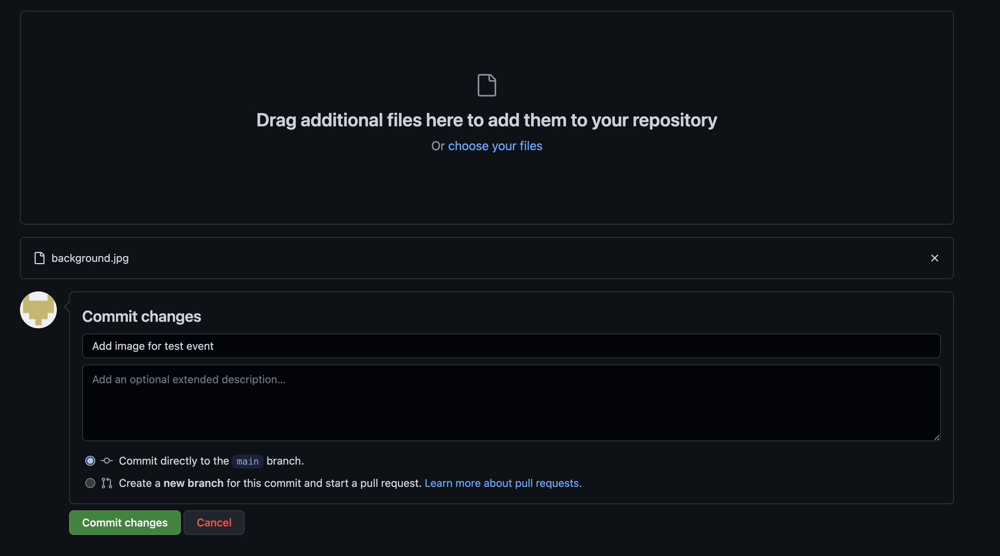

# The cIDA official website


# Introduction

This guide provides you with all the information needed to update and maintain content for the [cida website](https://websitemain23451.gtsb.io/). The only folder that you have to focus on is [src/content](./src/content). Inside that folder you will find 6 sub-folders that contain content for the different website sections:

- **about:** the *About* section 
- **hero:** the full-screen image (called a hero image in webdesign) and caption that you see on the landing page 
- **logos:** a collection of logos that are used throughout the website
- **members:** the *Members* section 
- **projects:** the *What's On* and *Archive* section. When content expires it automatically moves from What's On to *Archive*
- **publications:** the *Publications* section


## Markdown 
For this website, you will write all of your content in markdown. [Markdown](https://en.wikipedia.org/wiki/Markdown) is a simple language for creating formatted text. Markdown files usually end with a `.md` extension. The most important things to remember about markdown syntax are: 

- *italic text* is achieved by placing an asterisk before and after the text you want to be italicised, e.g. `*italicised text*`
- **bold text** is achieved by pacing two asterisks before and after the text you want to be bold, e.g. `**bold text**`
- ***italic and bold text*** is achieved by placing three asterisks before and after the text that you want to be bold and italicised, e.g. `***bold and italicised text***`
- links are written in the form `[name of the link](URL that you want to link to)` for example `[Link to Google](https://www.google.co.uk/)` will result in [Link to Google](https://www.google.co.uk/)
- images are included in the form `` for example `` will result in <br><br>Cute Kitty<br>You should always include a short description of the image in alt text to make your website accessible

You can read more about basic Markdown syntax [here](https://www.markdownguide.org/basic-syntax/) 

## Markdown frontmatter
When looking at any markdown files in this project you will notice that they will start with something like this: 

```
---
title: "International Conference in Ideology and Discourse Analysis 2019"
date: "2019-05-31"
endDate: "2019-06-01"
place: "University of Essex"
image: "./logics.png"
category: ["conference","event"]
time: ""
highlight: false
---
```

Everything between the `---` is called frontmatter. Frontmatter contains metadata for the content that you are creating, e.g. the title of an event and the date when it took place. This will make more sense when we talk about creating content for the individual sections.


## Uploading and creating files on GitHub
You can add content to any section by clicking `Add file` in the top left corner.



After clicking on `Add file` you can choose between `Create new file` and `Upload files`. 


If you want to add new written content (e.g. about an event), you can create a new markdown file. Give your file a unique name and don't forget the `md` extension. You can now add the content (keep the markdown syntax in mind).



To publish your content to the website, you will have to commit your changes. *Commit* is the term used in GitHub, you can think about it as *save&publish*. Every time you commit changes, you should provide a short description of what you have done. This can be something simple like *Created entry for event XYZ*



You can also upload files from your personal device. For example, you might want to add images or a pdf to a text that you have written about an event. Again you will have to commit your changes.

**You should upload images before you include them in your markdown.**



When opening a file on GitHub you will also have the option to delete or edit the file.


# How content works for individual sections 

This section explains how to add and edit content for different sections.

## About 
In the [about subfolder](src/content/about/) you will find one markdown file called `content.md`. The frontmatter looks like this:

```
---
title: About 
image: "../logos/cida_red_logo.png"
centre_logos:
- logo: "./desire-horizontal.png"
  logo_alt: "Desire logo"
  link: "https://www.researchcenterdesire.eu/" 
---
```

- **title** is self-explanatory, it's unlikely that will want to change this. 
- **image** is the logo that is shown next to the about text. If you want to change it to a different logo, you will have to upload another logo to the logos folder and change `cida_red_logo.png` to the name of the new logo.
- **centre_logos** describes the logos and links to associated centres. If you want to add more, you will first have to upload a new logo to the about folder. Then add a `-` under the previous entry in markdown and add the tags: *logo*,*logo_alt*,*link*. So a new entry could look something like this:
  ```
  centre_logos:
  - logo: "./desire-horizontal.png"
  logo_alt: "Desire logo"
  link: "https://www.researchcenterdesire.eu/" 
  - logo: "./new_logo.png"
  logo_alt: "Alt text for new logo"
  link: "https://www.url_to_associated_centre.com/" 
  ```

Below the frontmatter you can write the text that will be displayed in the about section. Please note that only the first paragraph will be shown directly. A user will have to click on *Read More* to reveal all remaining paragraphs. 

## Projects 

Projects describes a variety of content that will be shown in *What's On* and *Archive*. This could be events, blog posts, paper series etc.. There a quite a few tags in the markdown frontmatter. A plain example with all possible tags looks like this:

```
---
title: ""
date: ""
endDate: ""
expireDate: ""
place: ""
time: ""
category: [""]
highlight: false
image: ""
pdf: ""
---
```

Let's break down these tags:

- **title:** the title of the content e.g. `title: "Ideological Fantasy at work"`. You should always include this tag.
- **date:** the date of this piece of content. This could be the date for an event or the date on which you publish a blog post. The data is written in the format "yyyy-mm-dd" e.g. `date: "2019-05-31"`. You should always include this tag. **If the specified date is in the future the content will be shown in What's On, otherwise it will be shown in the Archive!**
- **endDate:** if an event like a conference extends over multiple days you can specify the end date here. If you don't need this tag, just leave it as ""
- **expireDate:** if you write something like a blog entry, you might choose the date of publishing for your date tag. If you don't want your post to be moved to Archive immediately, you can specify an expiration date for your blog entry at which your blog entry should be moved to the Archive. If you don't need this tag, just leave it as ""
- **place:** the location of an event, e.g. `place: "University of Essex"` If you don't need this tag, just leave it as ""
- **category:** the category of your content e.g. event or working paper series. Categories have to written within the [], multiple categories should be separated by a comma e.g. `category: ["conference","event"]`. Please specify at least one category and try to use categories that are already in use to describe your content. **Categories should be written with lower case letters only.**
- **time:** The time at which an event takes place. This should be written in military time e.g. `time: "16.30 - 18.00"` If you don't need this tag, just leave it as ""
- **highlight:** indicates whether content should be highlighted at the top of the What's On page. If content should be highlighted, write `true` else write `false`.

